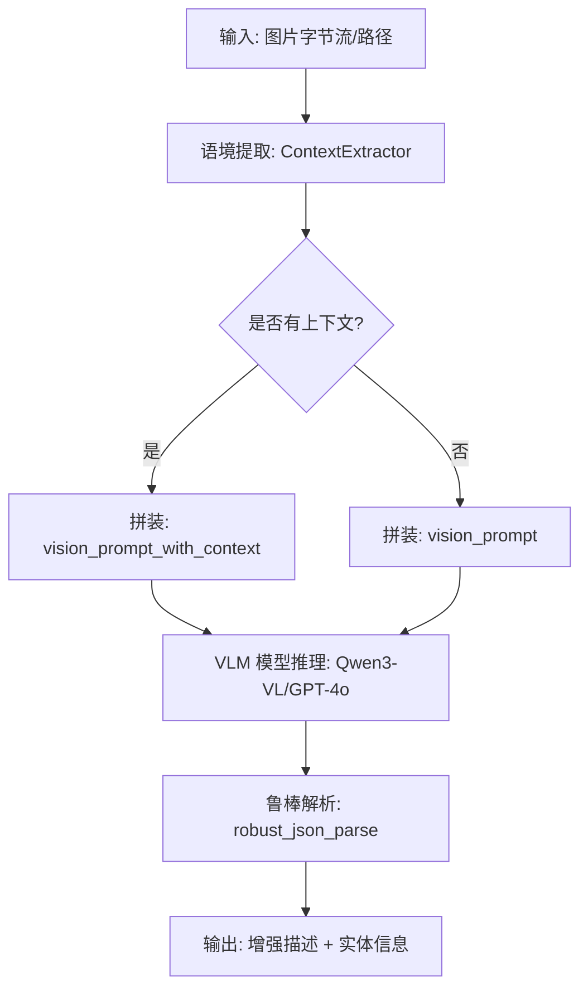

# Multi-modal Enhanced Caption 实现与移植深度指南

本手册旨在指导技术团队将 RAG-Anything 中的“多模态语义增强描述 (Enhanced Caption)”功能平移至其他业务平台。

---

## 1. 核心设计理念

在多模态 RAG 中，图片或表格如果不经过处理，其向量特征往往无法与文本查询有效匹配。**Enhanced Caption** 的目标是：
- **语义补全**：利用 VLM 将视觉信息（图表、逻辑关系）转化为详细文本。
- **语境对齐**：通过提取文档上下文，让模型知道元素在当前章节的特定含义。
- **结构化输出**：生成包含实体信息和详细描述的 JSON，同时支持全文检索和关系检索。

---

## 2. 总体架构流程



---

## 3. 核心模块源码与解析

### 3.1 语境提取模块 (`ContextExtractor`)
该模块负责在文档流中进行滑动窗口搜索。

```python
import logging
from typing import Dict, Any, List, Optional
from dataclasses import dataclass, field

@dataclass
class ContextConfig:
    context_window: int = 1  # 提取前后 N 页/块作为上下文
    max_context_tokens: int = 2000
    include_headers: bool = True
    filter_content_types: List[str] = field(default_factory=lambda: ["text"])

class ContextExtractor:
    """通用语境提取器，支持从文档列表中提取目标元素周边的文字"""
    def __init__(self, config: ContextConfig = None):
        self.config = config or ContextConfig()

    def extract_context(self, content_list: List[Dict], current_item_info: Dict) -> str:
        if not content_list: return ""
        
        current_page = current_item_info.get("page_idx", 0)
        window = self.config.context_window
        start_page = max(0, current_page - window)
        end_page = current_page + window + 1

        context_texts = []
        for item in content_list:
            if start_page <= item.get("page_idx", 0) < end_page:
                if item.get("type") in self.config.filter_content_types:
                    text = item.get("text", "")
                    if text: context_texts.append(text)
        
        return "\n".join(context_texts)[:self.config.max_context_tokens]
```

### 3.2 提示词模板仓库 (`prompt.py`)
定义了如何引导模型生成高质量的 JSON。

```python
# 核心提示词：带语境的视觉分析
VISION_PROMPT_WITH_CONTEXT = """Please analyze this image in detail, considering the surrounding context. Provide a JSON response:
{{
    "detailed_description": "A comprehensive visual description... reference connections to context...",
    "entity_info": {{
        "entity_name": "{entity_name}",
        "entity_type": "image",
        "summary": "concise summary including relationship to context"
    }}
}}

Context from surrounding content:
{context}

Image details:
- Image Path: {image_path}
- Captions: {captions}
"""

# 核心提示词：表格逻辑分析
TABLE_PROMPT_WITH_CONTEXT = """Please analyze this table content considering the surrounding context:
{{
    "detailed_description": "Analysis of trends, data points, and how it illustrates context...",
    "entity_info": {{ "entity_name": "{entity_name}", "entity_type": "table", "summary": "..." }}
}}

Context: {context}
Table Body: {table_body}
"""
```

### 3.3 鲁棒解析工具 (`json_utils.py`)
处理 LLM 不稳定的输出。

```python
# 请参考根目录生成的 json_utils.py 完整代码
# 包含：
# 1. extract_all_json_candidates (利用大括号平衡算法抠出 JSON)
# 2. progressive_quote_fix (修复未转义的反斜杠)
# 3. extract_fields_with_regex (终极正则兜底)
```

---

## 4. 移植集成步骤

同事在新平台集成时，请遵循以下步骤：

### 第一步：适配 VLM 接口
编写一个通用的异步函数来包装 VLM 调用。
```python
async def call_vlm(prompt: str, image_bytes: bytes):
    # 将 bytes 转 Base64
    img_b64 = base64.b64encode(image_bytes).decode("utf-8")
    # 调用你平台的模型 API (如 Qwen3-VL)
    # return raw_response_string
```

### 第二步：编写业务编排器
```python
from json_utils import robust_json_parse

async def process_image_element(img_bytes, doc_stream, pos_info):
    # 1. 提取语境
    ctx = extractor.extract_context(doc_stream, pos_info)
    
    # 2. 格式化提示词
    final_prompt = VISION_PROMPT_WITH_CONTEXT.format(
        context=ctx,
        entity_name="image_" + str(pos_info['index']),
        image_path="memory",
        captions=pos_info.get('caption', 'None')
    )
    
    # 3. 模型推理
    raw_response = await call_vlm(final_prompt, img_bytes)
    
    # 4. 结果解析
    result = robust_json_parse(raw_response)
    return result
```

---

## 5. Qwen3-VL 适配建议

针对同事询问的 **Qwen3-VL-8B-Instruct**：
1. **参数设置**：建议设置 `temperature=0.1` 以保证 JSON 输出的稳定性。
2. **System Prompt**：必须传入 `"You are an expert image analyst. Provide detailed, accurate descriptions and output valid JSON."`。
3. **优势**：该模型对图表中的 OCR 字符极其敏感，非常适合处理带有大量文字注记的技术文档图片。

---

## 6. 特殊集成案例：适配 Docling 解析器

如果你使用 **Docling** (IBM) 作为解析器，建议将 Enhanced Caption 作为“后处理富集层 (Enrichment Layer)”集成。Docling 的线性元素序列非常适合进行精准的语境提取。

### 6.1 适配逻辑：遍历 DocItem
Docling 解析后的 `DoclingDocument` 包含一个有序的 `items` 序列。

```python
from docling.datamodel.base_models import FigureElement, TableElement

async def enrich_docling_document(doc, vlm_func):
    all_items = list(doc.items)  # Docling 的阅读顺序序列
    
    for index, item in enumerate(all_items):
        # 1. 识别图片或表格
        if isinstance(item, (FigureElement, TableElement)):
            # 2. 提取语境 (利用 index 获取前后的 DocItem)
            context = extractor.extract_context_from_docling(all_items, index)
            
            # 3. 提取视觉/表格数据
            if isinstance(item, FigureElement):
                data = item.image.as_bytes() if hasattr(item, "image") else None
                prompt_type = "vision"
            else:
                data = item.export_to_markdown() # 直接获取表格 Markdown
                prompt_type = "table"

            # 4. 执行增强逻辑 (调用之前定义的编排器)
            enriched_result = await process_element(data, context, prompt_type)
            
            # 5. 回填数据
            # 建议将描述存储在 item.extra_data 或关联的自定义属性中
            item.enhanced_caption = enriched_result
```

### 6.2 ContextExtractor 的小幅改造
Docling 的 item 是对象而非字典，需要微调文本提取逻辑：

```python
def _extract_text_from_docling_item(item):
    if hasattr(item, "text") and item.text.strip():
        # 能够识别标题层级
        prefix = "#" * getattr(item, "level", 0) + " " if getattr(item, "level", 0) > 0 else ""
        return prefix + item.text
    return ""
```

---

## 7. 通用场景适配：基于已切分 Markdown 的语境注入

如果你已经完成了 Markdown 的切分（Chunks）或拥有 Token 流，可以采用更轻量化的注入方案。

### 7.1 注入策略
1.  **标题回溯 (Heading Trace-back)**：从当前 Chunk 向上寻找最近的标题块。
2.  **邻居块采样 (Neighboring Chunks)**：直接取当前块的前后各 1-2 个块作为背景。

### 7.2 代码实现参考
```python
def get_context_from_chunks(chunks: List[str], target_idx: int):
    # 1. 向上寻找最近标题 (以 # 开头的块)
    header = "Unknown Section"
    for i in range(target_idx - 1, -1, -1):
        if chunks[i].strip().startswith('#'):
            header = chunks[i].strip()
            break
            
    # 2. 获取邻近块 (前后各 1 块)
    prev_chunk = chunks[target_idx - 1] if target_idx > 0 else ""
    next_chunk = chunks[target_idx + 1] if target_idx < len(chunks) - 1 else ""
    
    return f"Context Header: {header}\nPrevious Content: {prev_chunk}\nFollowing Content: {next_chunk}"
```

---

## 8. 实现建议：性能与资源取舍 (Performance & Trade-offs)

在移植到新平台时，完整的多模态 RAG 流程由于涉及多次模型推理，可能会面临较高的时延。请根据业务场景参考以下取舍建议：

### 8.1 耗时操作清单
1.  **VLM 增强描述生成 (离线 - 高耗时)**：
    *   **环节**：对文档中的每一张图发起 VLM 请求。
    *   **建议**：这是多模态检索的基石，**不可剔除**。但建议采用**异步并行任务流**，利用 Celery 等工具在后台批量处理。
2.  **VLM 证据链验证 (在线 - 极高耗时)**：
    *   **环节**：在回答用户问题时，实时调用 VLM 对图片进行“终审”判分。
    *   **影响**：会让用户等待时间增加 2-5 秒。
    *   **建议**：若追求极致响应速度，可**禁用实时验证**，仅利用索引阶段存好的 `enhanced_caption` 进行文本级回答。
3.  **LibreOffice 转换 (预处理 - 中耗时)**：
    *   **环节**：将 Office 转为 PDF。
    *   **建议**：将其作为独立的消息队列任务，避免阻塞主解析流。

### 8.2 核心策略建议：坚持 JSON 流，远离完整 Markdown
*   **不要生成中间 Markdown 文件**：在整个移植链条中，始终传递结构化对象（List of Dict）。
*   **原因**：Markdown 会丢失页码、坐标等关键元数据。一旦转为 Markdown，你的 `ContextExtractor` 就只能靠正则模糊匹配，语境注入的精度会大幅下降。
*   **结论**：JSON 负责管理逻辑和物理关系，Markdown 只作为喂给 LLM 的临时展示载体。

---

## 9. 输入预处理与图像优化 (Input Pre-processing)

为了获得最佳的 Enhanced Caption 效果，建议在数据进入 VLM 之前参考以下预处理策略：

### 9.1 Markdown 渲染预处理
如果你的原始输入是 Markdown 文件，**不要直接作为纯文本处理**。建议先利用 `EnhancedMarkdownConverter`（参考 `docs/enhanced_markdown.md`）将其转换为 PDF。
*   **实现逻辑**：使用 WeasyPrint 或 Pandoc 配合专业 CSS（如包含表格边框、代码高亮的样式）生成 PDF。
*   **优势**：通过 PDF 渲染，可以将 Markdown 中松散的图片与文字重新“物理绑定”。利用 MinerU/Docling 对渲染后 PDF 的布局分析（Layout Analysis），能比直接正则解析 MD 获得更精准的 `page_idx` 和语境窗口。

### 9.2 针对 VLM 的图像优化
根据 `RAG-Anything` 的实践建议，在生成 Base64 字节流前应执行：
1.  **尺寸缩放**：将超高清图片等比例缩放（如最大宽度限制在 1536px）。过大的图片会显著增加传输延迟，且不一定提升识别率。
2.  **格式优化**：优先使用 **JPEG** 或 **WebP** 格式进行传输，利用合理的压缩比降低负载。
3.  **语法高亮增强**：如果图片包含代码或数学公式，渲染时确保开启语法高亮（如 Pygments）。色彩对比度的增加有助于 VLM（如 Qwen3-VL）区分代码逻辑结构。

### 9.3 表格渲染策略
*   **Markdown 表格化**：对于复杂表格，Docling 会将其导出为标准 Markdown 格式。在喂给 LLM 时，请确保保留完整的表格 Markdown 结构（含 `|---|` 符号），这是目前大模型理解数据趋势的最优格式。

---

## 10. 疑难杂症：视觉注意力劫持 (Visual Attention Hijacking)

在实际业务中，有一种常见的多模态处理痛点：当文档配图是**系统界面截图**、**功能演示图**或**包含大量示例文字的图片**时，VLM 往往会“舍本逐末”，疯狂转录图片里的占位文字，而忽略了图片试图展示的功能结构。

**例如**：上下文中在介绍“文档切分功能”，配图是一张文档切片界面的截图，里面包含了一段关于“风力发电机”的测试文本。VLM 生成的描述可能全是关于“风力发电机”的，导致该图片的向量特征完全失焦。

### 10.1 解决方案探讨

在不改变底层架构的前提下，建议在新平台中采用以下三种策略之一进行“注意力引导”：

#### 策略一：Prompt 级的“元认知”干预 (Meta-Cognitive Prompting)
修改 `VISION_PROMPT_WITH_CONTEXT`，在 Prompt 中强行加入“防劫持”指令。
*   **Prompt 示例补充**：“仔细阅读上下文。如果图片是一张系统界面或功能演示的截图，请注意：截图里的具体文字内容（如具体的业务数据、文章内容）通常只是**演示用的占位符（Dummy Data）**。你的核心任务是描述**图片展示了什么系统功能、操作效果或界面结构**，**绝对不要**去总结截图里那些占位符文章的具体内容！”

#### 策略二：强关联上下文过滤 (Context-Anchored Filtering)
直接将 Context 提升为绝对准绳。
*   **Prompt 示例补充**：“你必须以提供的 Context 为绝对核心。如果图片中出现了大量的文字或元素，**只提取和描述那些与 Context 主题直接相关的部分**。如果图片中的文字内容与 Context 的主题毫不相干，请完全忽略这些文字。”

#### 策略三：物理层面的视觉提示 (Visual Prompting) - 最有效
大模型对人类的视觉标记极其敏感。这需要在生成文档阶段进行规范：
*   **建议**：在制作文档截图时，使用**红色框线**或**高亮箭头**圈出想展示的功能区域（例如切分线的位置）。
*   **配合 Prompt**：“请重点关注并描述图片中带有**红色框线或箭头标记**的区域。”这能瞬间将 VLM 的注意力从繁杂的背景文字中拉回核心功能点。

---

## 11. 总结

该移植方案通过 **ContextExtractor (找语境) -> Prompt (下指令) -> VLM (生成) -> robust_json_parse (纠错)** 形成了一个闭环。通过这套流程，新平台的多模态 RAG 检索精度预计能获得显著提升。
